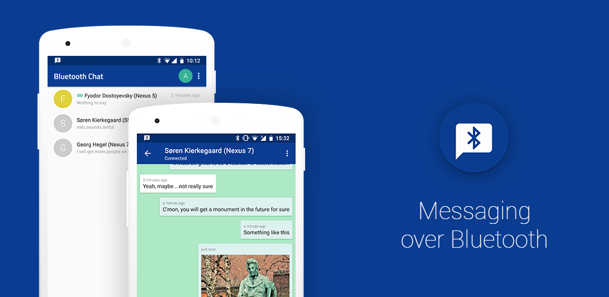

# Bluetooth Chat

1-to-1 chatting app over Bluetooth

This project is a test area for trying and mastering fancy programming stuff: Kotlin, MVP, DI, Coroutines, testing, Architecture Components, the newest Android features.

<https://github.com/user-attachments/assets/9b55463c-eb65-4c14-989d-21b0e8330faa>

Localization 
--------
You can help to localize Bluetooth Chat to your language using [Crowdin](https://crowdin.com/project/bluetoothchat)

Third Party Libraries
--------
* [sticky-headers-recyclerview](https://github.com/timehop/sticky-headers-recyclerview)
* [Android-RateThisApp](https://github.com/kobakei/Android-RateThisApp)
* [TextDrawable](https://github.com/amulyakhare/TextDrawable)
* [EasyImage](https://github.com/jkwiecien/EasyImage)
* [PhotoView](https://github.com/chrisbanes/PhotoView)
* [Picasso](https://github.com/square/picasso)
* [Chroma](https://github.com/ItsPriyesh/chroma)
* [MockK](https://github.com/oleksiyp/mockk)
* [Koin](https://github.com/InsertKoinIO/koin)

